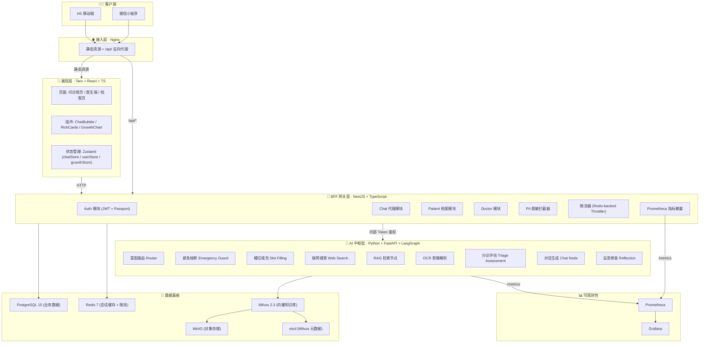
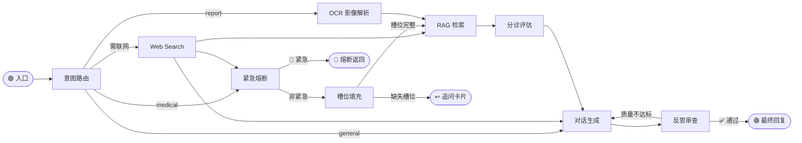

# 智慧儿科 AI Agent 系统

基于大语言模型与多智能体（Multi-Agent）技术的“To C 育儿陪伴 + To B 诊所辅助”双引擎架构系统。该系统旨在填补家长院外护理的知识盲区，并有效降低儿科医生的沟通与基础文书负荷。

## 🏗 系统架构

项目采用 **展现层 → BFF 网关层 → AI 中枢层 → 数据基座** 的四层解耦架构，辅以可观测性监控层实现全链路度量。前后端跨语言（TypeScript / Python）通过 `@pediatric-ai/shared-types` 共享类型契约，由 pnpm Workspace Monorepo 统一治理。

### 架构总览



---

### 📱 L1 · 展现层

| 技术 | 版本 | 职责 |
| :--- | :--- | :--- |
| **Taro** | 4.2 | 跨端框架，一套 React 代码编译至微信小程序 + H5 |
| **React** | 18.x | UI 渲染引擎，Hooks 驱动 |
| **TypeScript** | 5.x | 全量类型覆盖，通过 `@pediatric-ai/shared-types` 与 BFF 共享接口契约 |
| **NutUI-React-Taro** | 3.x | 京东开源移动端组件库，医疗表单高频组件 |
| **Zustand** | 5.x | 轻量状态管理（chatStore / userStore / growthStore） |
| **ECharts** | 6.x | 生长曲线可视化（WHO 标准百分位图） |
| **Marked** | 18.x | Markdown 渲染（AI 回复富文本） |

**关键页面**：问诊首页（`index`）、医生端（`doctor`）、患儿档案（`profile`）
**核心组件**：`ChatBubble`（对话气泡）、`ChatInputBar`（多模态输入栏）、`RichCards`（槽位追问卡片）、`GrowthChart`（生长曲线图）

---

### 🔐 L2 · BFF 网关层

| 技术 | 版本 | 职责 |
| :--- | :--- | :--- |
| **NestJS** | 11.x | 企业级 Node.js 框架，IoC 依赖注入 |
| **TypeORM** | 1.x | PostgreSQL ORM，Migration 自动执行 |
| **Passport + JWT** | — | 无状态身份认证 |
| **ioredis** | 5.x | 会话缓存 + 分布式限流后端 |
| **@nestjs/throttler** | 6.x | 全局 API 限流（30 req/min，Redis 存储） |
| **PII Interceptor** | 自研 | 请求拦截器，将患者明文隐私 Hash 替换后再转发至 AI 层 |
| **nestjs-prometheus** | — | Prometheus 指标暴露 (`/metrics`) |
| **Winston** | 3.x | 结构化日志 |

**业务模块**：`AuthModule` → `ChatModule` → `PatientModule` → `DoctorModule`
**安全机制**：所有请求经 PII 拦截器脱敏 → Throttler 限流 → JWT 鉴权后，通过内部 Token 转发至 AI 中枢。

---

### 🧠 L3 · AI 中枢层

| 技术 | 版本 | 职责 |
| :--- | :--- | :--- |
| **FastAPI** | — | 异步 HTTP 服务框架（Uvicorn 驱动） |
| **LangGraph** | — | 有状态多智能体编排引擎（StateGraph + MemorySaver） |
| **LangChain + langchain-openai** | — | LLM 调用抽象层，兼容 Qwen / GLM 等国产模型 |
| **PyMilvus + langchain-milvus** | — | 向量检索客户端 |
| **pypdf** | — | PDF 文献解析（知识库灌注） |
| **duckduckgo-search** | — | 联网补充检索 |
| **prometheus-client** | — | Python 侧 Prometheus 指标 |

**LangGraph 状态机流转**：



**核心状态字段**：`intent`（意图）→ `slots`（体征槽位，30 分钟自动过期）→ `context`（RAG 知识）→ `assessment`（四级分诊）→ `reply`（最终回复）
**大模型基座**：阿里云 Qwen 系列（文本 `qwen3.6-plus` / 视觉 `qwen-vl-plus`），通过 OpenAI 兼容接口调用。

---

### 💾 L4 · 数据基座

| 组件 | 版本 | 职责 | 端口 |
| :--- | :--- | :--- | :--- |
| **PostgreSQL** | 15 Alpine | 业务主库（患儿档案、医生信息、会话记录） | 5432 |
| **Redis** | 7 Alpine | 会话缓存 + BFF 限流分布式后端 | 6379 |
| **Milvus** | 2.3 Standalone | RAG 向量知识库（`pediatric_guidelines` Collection） | 19530 |
| **MinIO** | 2023-03 | Milvus 对象存储后端 | 9000 |
| **etcd** | 3.5.5 | Milvus 元数据存储 | 2379 |

---

### 📊 L5 · 可观测性

| 组件 | 版本 | 职责 | 端口 |
| :--- | :--- | :--- | :--- |
| **Prometheus** | 2.45 | 指标采集（BFF `/metrics` + AI Engine `/metrics`，15s 间隔） | 9090 |
| **Grafana** | 10.0 | 监控仪表盘与告警可视化 | 3001 |

---

### 🏭 工程基座

| 能力 | 技术选型 | 说明 |
| :--- | :--- | :--- |
| **Monorepo 治理** | pnpm Workspace | 幽灵依赖拦截 + 共享包 `@pediatric-ai/shared-types` 实现跨服务类型收敛 |
| **容器化** | Docker Compose (12 服务) | 含 3 个业务服务 + 5 个基础设施 + 2 个监控 + Nginx 接入层 |
| **静态资源 / 反代** | Nginx | 前端静态文件托管 + `/api/` 反向代理至 BFF:3000 |
| **CI 构建** | Dockerfile × 3 | `Dockerfile.frontend` / `Dockerfile.bff` / `Dockerfile.ai-engine` |

---

## 🚀 本地开发启动指南

项目采用物理隔离架构，联调时需要并发拉起三个核心服务域。

> 注意：根目录 `.env` / `.env.staging` 已废弃，仅保留为迁移阶段参考文件。新增或修改本地运行配置时，请只使用各服务目录下的 `.env`。

### 0. 环境前置要求
- Node.js >= 18.0.0
- Python >= 3.10
- pnpm >= 8.0.0

### 1. 启动 AI 中枢引擎 (占用端口: 8000)
承担全域大模型推理与意图分发。
```bash
pnpm run dev:ai
```

启动前请先准备：
- `services/ai-engine/.env`
- 可参考 `services/ai-engine/.env.example`

### 2. 启动 BFF 代理网关 (占用端口: 3000)
承担安全合规拦截与 HTTP 跨域代理。
```bash
pnpm install
pnpm run dev:bff
```

启动前请先准备：
- `apps/bff/.env`
- 可参考 `apps/bff/.env.example`

### 3. 启动前端展现层 (H5 联调端占用端口: 10086)
```bash
pnpm install
pnpm run dev:frontend
```

启动前请先准备：
- `apps/frontend/.env`
- 可参考 `apps/frontend/.env.example`

默认 H5 开发服务器监听在 `0.0.0.0`，按 Taro 当前输出端口访问即可。

### 4. 配置文件规范

本项目已改为按服务边界分别管理本地配置：

- `apps/bff/.env`
- `services/ai-engine/.env`
- `apps/frontend/.env`

根目录 `.env` / `.env.staging` 已废弃，不再作为默认运行入口。
详见：[docs/config-migration.md](docs/config-migration.md)
变量清单详见：[docs/config-reference.md](docs/config-reference.md)

### 5. Git 与敏感文件约束

在执行 `git init`、`git add` 或推送到 GitHub 前，先确认以下内容不会进入版本库：

- 各服务真实配置文件：`apps/bff/.env`、`apps/frontend/.env`、`services/ai-engine/.env`
- 本地日志与调试输出：`apps/bff/logs/`、`*.log`
- 用户上传内容与影像文件：`services/ai-engine/uploads/`、`services/ai-engine/private_uploads/`
- 本地构建与运行产物：`apps/bff/dist/`、`services/ai-engine/.venv/`、`coverage/`

仓库根目录已配置 `.gitignore` 进行默认拦截，但 `gitignore` 不是安全边界：

- 只保留 `*.env.example` 作为配置模板，不要提交真实密钥、JWT 私钥、数据库密码或第三方 API Key
- 若任何敏感文件曾进入 Git 历史，必须视为泄露并立即轮换对应凭证
- 医疗问诊日志、患儿图片、诊断上下文默认按敏感数据处理，不应公开上传

---

## 🛡 医疗合规与代码红线
1. **PII 脱敏机制**：严禁向大模型及 AI 中枢引擎直传任何包含明文患者隐私（PII）的信息。脱敏与 Hash 替换必须在 BFF 网关层拦截。
2. **强制类型收敛**：跨包的 TypeScript 接口必须维护在 `@pediatric-ai/shared-types` 共享包内。
3. **大模型幻觉风控**：前端渲染任何由大模型生成的护理建议时，必须附带硬编码的**免责声明**。RAG 检索的内容必须透出文献追溯标识。
